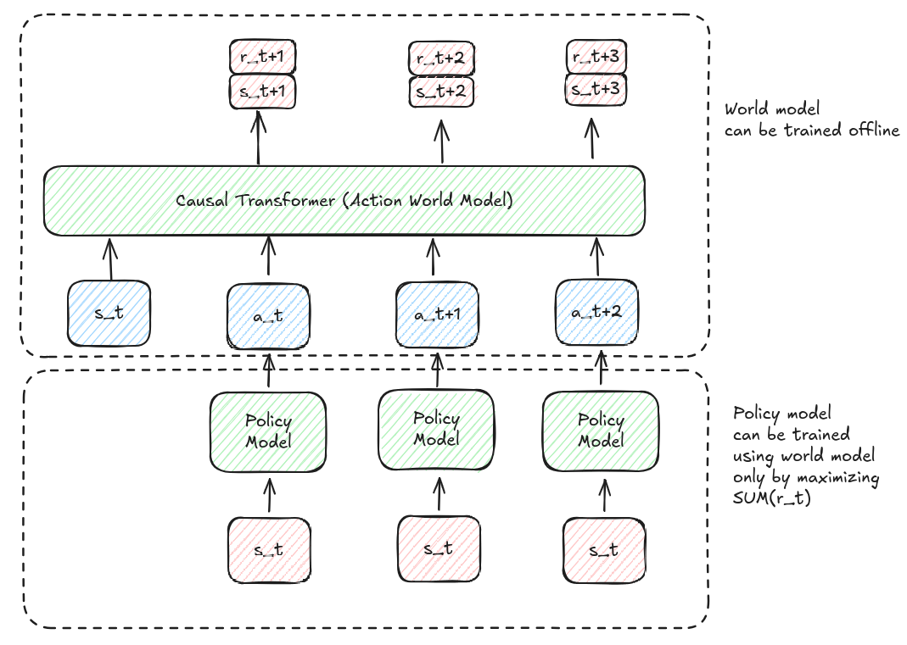
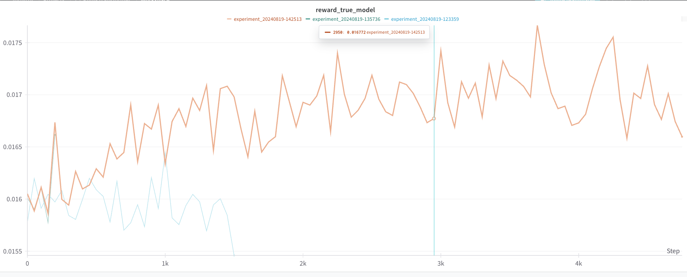
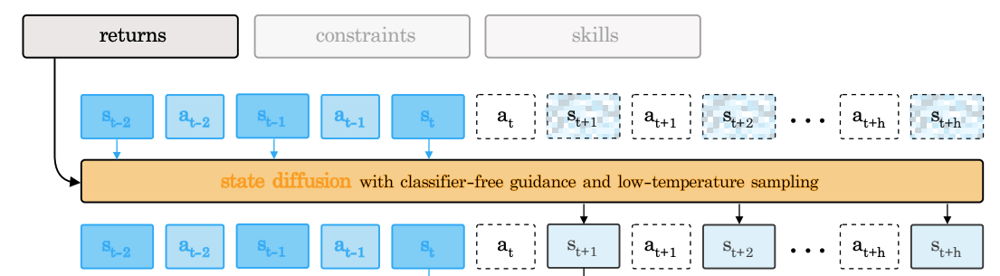
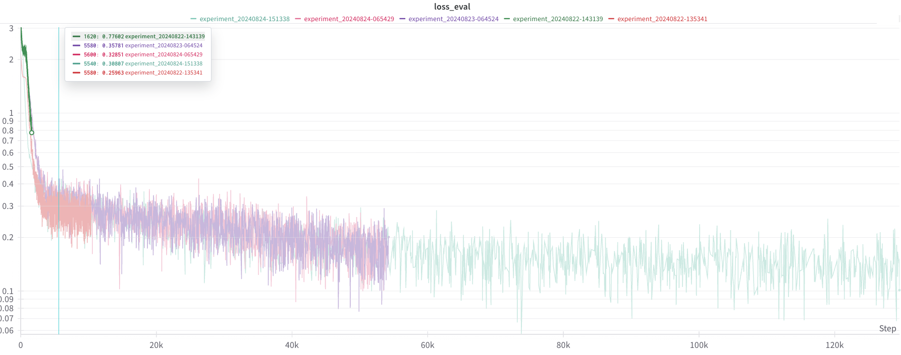
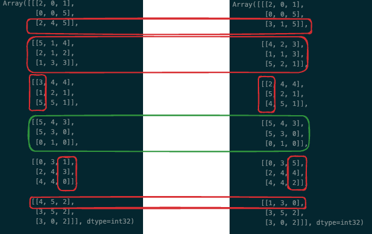
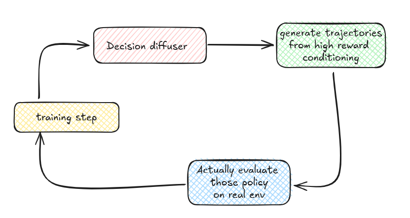

# rubikscubesolver
Solving rubik's cube with transformer world model

Experience 1 : 

The idea is to use new architecture and RL algorithm around transformer and world model to solve rubik's cube.

Inspired from : 

- DO TRANSFORMER WORLD MODELS GIVE BETTER POLICY GRADIENTS ? (https://arxiv.org/pdf/2402.05290)  

- TRANSFORMER-BASED WORLD MODELS ARE HAPPY WITH 100K INTERACTIONS (https://arxiv.org/pdf/2303.07109)

Experience 2 : 

After the not-working epxerience 1, we try another approach the decision transformer / inverse RL setup :

Inspired from :

- IS CONDITIONAL GENERATIVE MODELING ALL YOU NEED FOR DECISION-MAKING (https://arxiv.org/pdf/2211.15657)

- Decision Transformer: Reinforcement Learning via Sequence Modeling (https://arxiv.org/abs/2106.01345)

#### Experience 1 : Steps in order to train a proper world model

This is the overall training architecture :

We can first train a world model with data gather from random experience (or policy experience).

Then we can train a policy model with the loss directly being the sum of reward.

## Differents experiences

- Gumble softmax gives really unstable gradiant.

- Better have a model trained on policy probabilities than exact results (for world model)

- Should we be using a causal transformer for the policy model too ? Doesn't work great

- Forcing the WM to train only for non proba (High scale / temperature) degrade the performance

Overall bad results. The model actually progress toward improving the reward but this is not enough : 

Conclusion : using a world model gradient doesn't work great.

#### Experience 2 : Step to train a decision diffuser transformer

We use the same setup than in the paper (https://arxiv.org/pdf/2211.15657), currently experiencing

Current architecture setup for the decision transformer (taken from paper) :

Results converge well and by choosing "small noise" of the dirichlet distribution only the decision transformer can simulate a few step :

We manually check that the model achieve to simulate some step and indeed :

(simulation of one typical rubik move)

Now we want to choose the action that will make the model solve the rubik's cube.

Here is the setup to improve the model output :

